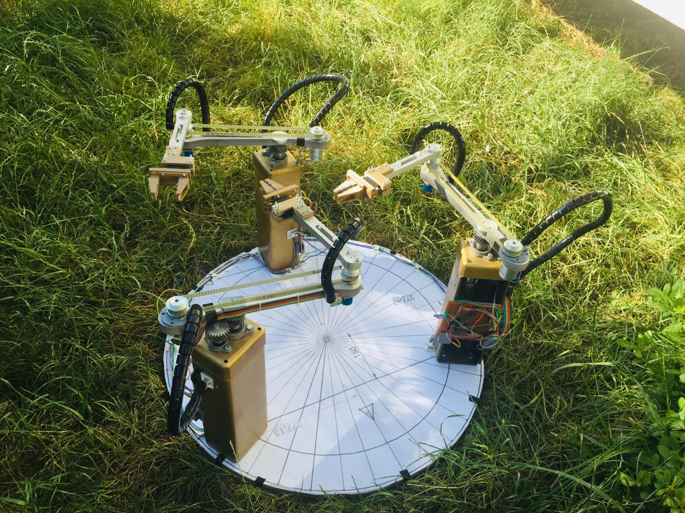
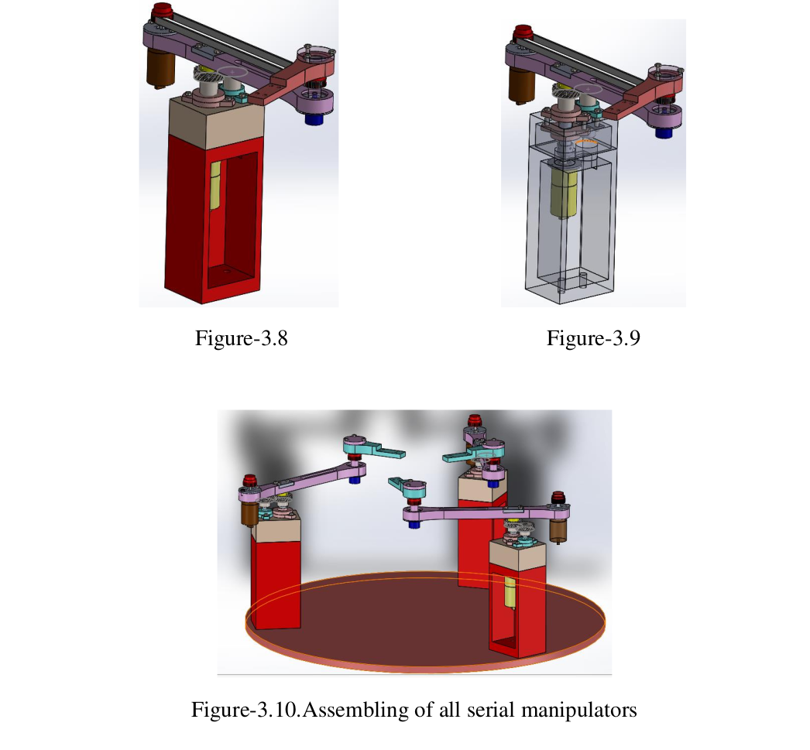
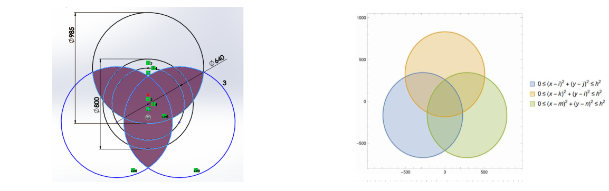
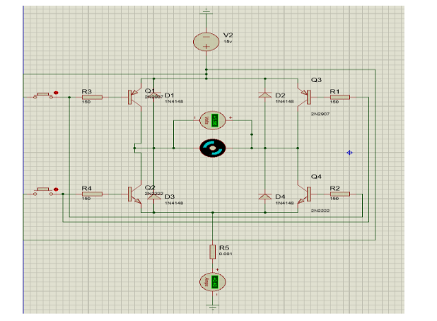

# RoboCraft: Reconfigurable Planar Parallel Manipulator 🤖🔧


<p align="center">
  <strong>RoboCraft — a reconfigurable three-arm planar manipulator</strong>
</p>

A mechatronics graduation project investigating a **multi-degree-of-freedom redundant, reconfigurable planar manipulator** built from three detachable 2-DOF serial manipulators.

The project combines mechanical design, kinematic and dynamic analysis, trajectory generation, embedded control, Raspberry Pi ↔ ATmega communication, image processing, obstacle avoidance, and task-level motion including platform rotation and square drawing.

> **Project status:** This repository contains academic/graduation-project source reconstructed from the supplied thesis and code appendix. It has been organized for readability and reuse, but the recovered legacy code has **not been independently validated or made hardware-safe**.

---

## Project overview

The thesis describes a reconfigurable system in which three 2-DOF serial manipulators can operate independently or together as a synchronized parallel mechanism.

### Key project data

- **Three 2-DOF serial manipulators**
- **6 motorized joints** supporting a **3-DOF task-space platform**
- Reconfigurable operation as individual serial manipulators or as a parallel mechanism
- Compactness constraint based on an **800 mm radius** footprint
- Reported dexterous workspace of **383,438 mm²**
- Reported link dimensions of **220 mm + 220 mm**
- **60 mm hexagonal platform**
- Reported workspace performance measure of **PC1 ≈ 0.95**
- Minimum payload requirement of **0.200 kg**
- Maximum allowable deflection of **2.5 mm**
- DC motors with potentiometer-based position feedback
- H-bridge motor driving
- Raspberry Pi ↔ ATmega communication over **I²C**
- Via-point and polynomial trajectory generation
- OpenCV-based green-obstacle detection
- Mechanical platform/gripper locking concept
- Control discussion based on **Ziegler–Nichols tuning**

These values are project-specific data reported in the supplied thesis and should not be interpreted as general specifications for the repository code.

---

## Visual overview

### Complete robot

<p align="center">
  
</p>

**RoboCraft — reconfigurable three-arm planar manipulator.**

### Mechanical design

<p align="center">
  
</p>

**3D/CAD design of the manipulator mechanism.**

### Workspace analysis

<p align="center">
  
</p>

**Workspace analysis used to evaluate the manipulator's reachable operating region.**

The thesis reports a dexterous workspace of **383,438 mm²** and a workspace performance measure of approximately **PC1 = 0.95**.

### Motor-driver electronics

<p align="center">
  
</p>

**Electronic circuit / motor-driver schematic used in the project.**

> The README currently uses the four project figures prepared in `docs/figures/`. Additional thesis figures can be added later under the same directory without making the landing page unnecessarily long.

---

## What the project does

At a high level, the system follows this workflow:

```text
Task / target
     │
     ▼
Trajectory generation + inverse kinematics
     │
     ▼
Raspberry Pi master controller
     │
     │ I²C
     ├──────────────┬──────────────┐
     ▼              ▼              ▼
 ATmega 1        ATmega 2       ATmega 3
     │              │              │
 Motors +        Motors +       Motors +
potentiometers  potentiometers  potentiometers
     │              │              │
     └──────────────┼──────────────┘
                    ▼
        Reconfigurable robot mechanism
```

The exact electrical topology, I²C addressing, GPIO assignments and calibration values should be checked against the physical hardware before deployment.

---

## Kinematics and trajectory generation

The thesis develops and discusses:

- Denavit–Hartenberg parameterization
- Forward kinematics
- Jacobian-based velocity analysis
- Singular configurations
- Inverse kinematics
- Dynamic and torque analysis
- Trajectory generation

The supplied trajectory code calculates an initial end-effector position, constructs a via point from geometric constraints, computes inverse-kinematic joint angles, and generates polynomial trajectory segments for the actuators.

The appendix contains implementation-specific constants such as `a2 = 230` and `b2 = 230` in several code paths. These should not automatically be treated as the final mechanical dimensions reported in the thesis; they belong to the recovered implementation and may reflect a particular project stage.

---

## Main control tasks

### 1. Trajectory generation

The trajectory-generation program is intended to generate configurable manipulator motion from end-effector positions and orientations. It computes via points, inverse-kinematic joint values and polynomial joint trajectories.

### 2. Raspberry Pi ↔ ATmega communication

The Raspberry Pi side acts as the master in the communication workflow. The ATmega/Arduino side receives references, reads potentiometer feedback and controls the motor outputs.

The recovered implementation contains project-specific communication addresses, calibration values and hardware assumptions. These should be verified before any hardware use.

### 3. Pure rotation / reconfiguration

The pure-rotation task is associated with platform attachment/detachment and reconfiguration. The appendix includes servo outputs and geometric calculations related to the hexagonal platform.

### 4. Square drawing / pure translation

The square-drawing task coordinates manipulator motion through successive square segments. The thesis presents this as an example task and discusses possible applications such as laser cutting.

### 5. Image processing and obstacle avoidance

The thesis also documents an OpenCV-based vision pipeline that:

1. Captures frames from an external camera.
2. Converts the image to HSV representation.
3. Thresholds the green obstacle.
4. Applies masking and median filtering.
5. Detects image features/edges.
6. Uses the detected obstacle information to support path generation.

The supplied `codesappendix.pdf` is primarily focused on trajectory generation, Raspberry Pi/ATmega communication, pure rotation and square drawing; the vision implementation is documented separately in the thesis.

---

## Repository structure

```text
RoboCraft/
├── README.md
├── requirements.txt
├── docs/
│   ├── CODE_ORIGIN.md
│   └── figures/
│       ├── 3d_design.png
│       ├── electronic_circuit_driver_schematic.png
│       ├── robot.jpeg
│       └── workspace_analysis.png
└── src/
    ├── trajectory/
    │   └── trajectory_generation.py
    ├── communication/
    │   ├── master_raspberry_pi.py
    │   └── slave_atmega.ino
    └── tasks/
        ├── pure_rotation.py
        └── drawing_square.py
```

### Source modules

| File | Role |
|---|---|
| `src/trajectory/trajectory_generation.py` | Via-point generation, inverse kinematics and polynomial trajectory generation |
| `src/communication/master_raspberry_pi.py` | Raspberry Pi side of the control/communication workflow |
| `src/communication/slave_atmega.ino` | ATmega/Arduino-side I²C reception, potentiometer feedback and motor control |
| `src/tasks/pure_rotation.py` | Platform pure-rotation / attachment-detachment task |
| `src/tasks/drawing_square.py` | Coordinated manipulator motion for the square-drawing task |

---

## Hardware

The thesis describes the following project hardware:

- Three planar 2-DOF manipulator units
- DC motors
- Potentiometers for joint-position feedback
- H-bridge motor drivers
- ATmega microcontrollers
- Raspberry Pi
- External camera
- Grippers and a mechanical platform-locking mechanism
- Bearings, belts, shafts/gears and fabricated links

## Software and engineering tools

The project uses or discusses:

- Python
- NumPy
- SymPy
- Matplotlib
- PySerial
- SMBus / I²C
- RPi.GPIO
- OpenCV
- SolidWorks
- Mathematica
- Arduino/ATmega development tools

Install the Python dependencies with:

```bash
pip install -r requirements.txt
```

`RPi.GPIO` and `smbus2` are hardware-specific dependencies intended for Raspberry Pi environments.

---

## Legacy-code and hardware safety warning

The source in this repository was reconstructed from a PDF appendix. It should therefore be treated as **research/project source material**, not production firmware.

Before connecting motors:

- Verify every GPIO assignment and I²C address.
- Verify motor direction and H-bridge wiring.
- Verify potentiometer calibration and reference offsets.
- Verify angle units, scaling and sign conventions.
- Test with motors mechanically unloaded.
- Add appropriate current, position and limit protections.
- Check all trajectory and workspace limits.
- Confirm the software against the actual PCB and wiring.
- Use a controlled hardware commissioning procedure.

The recovered appendix contains hard-coded calibration values and hardware addresses. A future software revision should move these values into a dedicated configuration layer.

**Do not run the recovered motor-control code on the physical robot without first validating the hardware interface and control limits.**

---

## Development roadmap

The current repository is an organized reconstruction of the project source. A natural next software iteration would separate the implementation into:

```text
src/
├── kinematics/
├── trajectory/
├── control/
├── communication/
├── vision/
├── tasks/
└── hardware/
```

Recommended improvements include:

- Move link lengths, joint offsets, GPIO pins, I²C addresses, PWM limits and camera parameters into configuration.
- Separate kinematics from hardware I/O.
- Add explicit coordinate-frame and angle-unit conventions.
- Add tests for forward/inverse kinematics and trajectory continuity.
- Add tests for communication-packet encoding/decoding.
- Add hardware-independent simulation before motor commissioning.
- Add a dedicated vision module for obstacle detection and path generation.
- Document the actual PCB, wiring and I²C topology used by the final build.

---

## Project documentation

The repository is based on the supplied graduation thesis and code appendix. The thesis covers the mechanical design, workspace analysis, kinematics, dynamics, electronics, trajectory generation, control and image-processing aspects of the project.

`docs/CODE_ORIGIN.md` records the provenance and limitations of the reconstructed source files.

For a detailed technical description, the thesis should remain the primary reference for project-specific dimensions, performance values and design decisions.

---

## Citation / attribution

If you use or extend this repository in an academic context, cite the original graduation project/thesis and identify any modifications made to the recovered source code.
