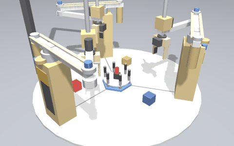
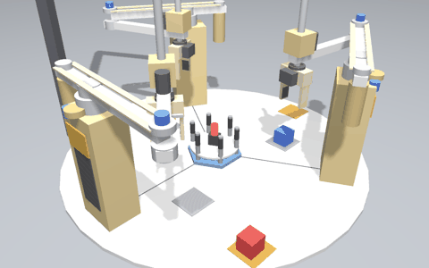
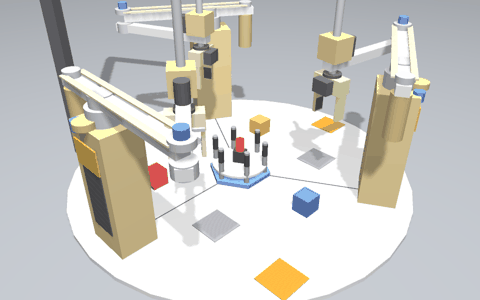
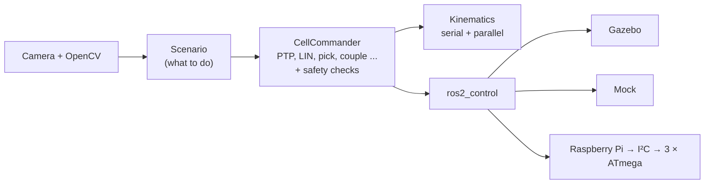
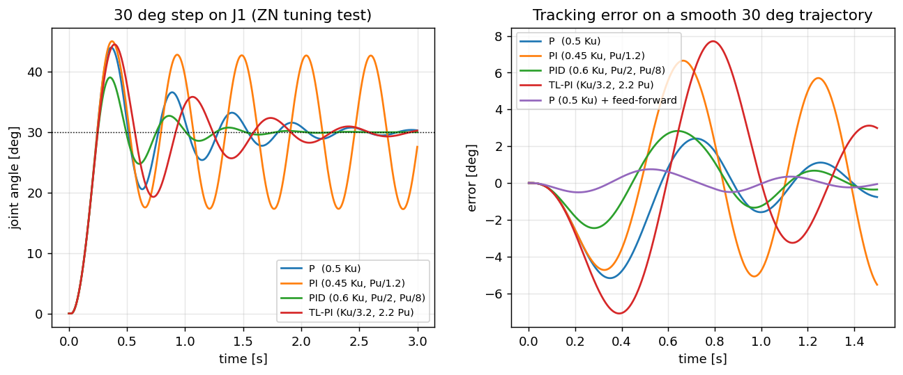

# RoboCraft: reconfigurable three‑arm SCARA cell

[](https://github.com/basheeraltawil/reconfigurable-scara-robot-cell-ros2/actions/workflows/ci.yml)


[](LICENSE)

**Three SCARA robots that work alone *or* join together through a hexagonal platform to
become one parallel robot.** The system switches between the two modes by itself.

It started as my mechatronics bachelor project in 2019 (design, manufacturing, electronics and
control of a real prototype). I have since rebuilt it as an industrial‑style **ROS 2 / Gazebo**
system with eight application scenarios, a verified engineering analysis and a real‑hardware driver.

<p align="center">
  <br>
  <sub>Serial pick-and-place → the arms couple to the platform → laser square → handover rotation → back to serial work (Gazebo physics)</sub>
</p>

## Highlights

| | |
|---|---|
| **Robotics** | serial and **parallel kinematics** (3‑RRR), redundant actuation, singularity analysis, PTP/LIN trajectories, collision checks between robots |
| **Software** | ROS 2 (actions, ros2_control, launch), Python and C++17, Gazebo system plugin, 39 automated tests, GitHub Actions CI |
| **Control** | DC‑motor modelling, Ziegler–Nichols tuning, velocity feed‑forward (tracking error 5° → 0.75°) |
| **Vision** | OpenCV colour classification and pixel‑to‑world projection for sorting and obstacle avoidance |
| **Embedded** | ros2_control I²C driver for the Raspberry Pi, ATmega firmware with CRC‑checked protocol and watchdog |
| **Mechanical** | link sizing (deflection/stress), motor sizing (Lagrange dynamics), workspace optimisation |

## Industrial scenarios

| Scenario | Real‑world task |
|---|---|
| `vision_sorting` | camera quality inspection: defective (red) parts to the reject bin |
| `laser_cutting_profile` | laser cutting a 100 × 70 mm plate with a bolt hole (hole first, then outline) |
| `obstacle_square` | cutting around a clamp or keep‑out zone found by the camera |
| `serial_pick_place` | three independent machine‑tending stations sharing one table |
| `pure_rotation` | turning a workpiece 360° by handing it over between robots |
| `locked_transport` | one robot moving a fixture alone (brake engaged) |
| `parallel_square`, `reconfiguration_demo` | laser engraving; flexible switching between tasks |

<p align="center">
  
  
</p>

All scenarios are verified in Gazebo physics. For example, the laser path measured in the
simulation matches the 100 × 70 mm part, and the camera locates parts to within 3.5 mm.
→ [Scenarios and results](docs/03_simulation_and_scenarios.md)

## Quick start

Ubuntu 22.04, ROS 2 Humble, Gazebo Fortress:

```bash
sudo apt install ros-humble-desktop ros-humble-ros-gz ros-humble-gz-ros2-control \
  ros-humble-ros2-control ros-humble-ros2-controllers ros-humble-xacro \
  ros-humble-joint-state-publisher-gui ros-humble-cv-bridge \
  ignition-fortress libignition-gazebo6-dev python3-opencv python3-pytest

git clone https://github.com/basheeraltawil/reconfigurable-scara-robot-cell-ros2.git
cd reconfigurable-scara-robot-cell-ros2/robocraft_ws
source /opt/ros/humble/setup.bash
colcon build --symlink-install && source install/setup.bash

ros2 launch robocraft_bringup sim.launch.py scenario:=vision_sorting        # Gazebo + RViz
ros2 launch robocraft_bringup mock.launch.py scenario:=pure_rotation        # no physics, fast
ros2 run robocraft_control scenario list                                    # all scenarios
```

Only the engineering calculations (no ROS needed):

```bash
pip install -r analysis/requirements.txt && python3 analysis/run_all.py
```

## How it works



One scenario runs unchanged in the unit tests, on mock hardware, in Gazebo and on the real robot.
→ [Kinematics and control](docs/02_kinematics_and_control.md)

## Engineering analysis

Eight short scripts recompute the thesis design with the formulas explained:
→ [analysis/](analysis/README.md)

| Question | Answer |
|---|---|
| Is the motor strong enough? | peak 2.18 N·m at full speed; the 42 kg·cm motor keeps a ×1.6 margin |
| Are the links stiff enough? | 0.29 mm deflection (limit 2.5 mm); 1.85 mm even at the 70 N test load |
| Why was the prototype imprecise? | 10‑bit ADC on a 10‑turn potentiometer = 27 mm steps at the tip → use a 16‑bit ADC or an encoder |
| Which controller? | model‑based Ziegler–Nichols gains + feed‑forward: 0.75° tracking error |
| Where can the platform go? | 86 752 mm² at a fixed orientation, ±90° rotation around the centre |

<p align="center">
  
</p>

## Repository

```
├── robocraft_ws/     ROS 2 workspace (7 packages): model, kinematics, control, scenarios, Gazebo plugin, hardware
├── analysis/         engineering calculations with explained formulas (+ figures)
├── docs/             design, kinematics & control, scenarios, hardware, developer guide
└── thesis_2019/      the original thesis, code appendix, figures and legacy code
```

| Documentation | |
|---|---|
| [1. Design](docs/01_design.md) | 2019 mechanical and electrical design and the industrial upgrades |
| [2. Kinematics and control](docs/02_kinematics_and_control.md) | equations, trajectories, safety, software architecture |
| [3. Simulation and scenarios](docs/03_simulation_and_scenarios.md) | Gazebo setup, 8 scenarios, measured results |
| [4. Hardware](docs/04_hardware.md) | electronics, protocol, firmware, commissioning |
| [5. Developer guide](docs/05_developer_guide.md) | code map, adding a scenario, tests, CI |


Licensed under [MIT](LICENSE). Citation information: [CITATION.cff](CITATION.cff).
