# RoboCraft: reconfigurable 3‑arm SCARA cell (ROS 2 + Gazebo)

<p align="center">
  
</p>

<p align="center">
  <b>Three SCARA arms that work alone (serial mode) or clamp a hexagonal platform together
  (parallel mode), switching between modes without human help.</b><br>
  Bachelor graduation project (İzmir Kâtip Çelebi University, 2019), rebuilt as a
  ROS 2 Humble / Gazebo Fortress / ros2_control workspace with industrial‑style arms,
  six simulation scenarios, vision and a real‑hardware driver.
</p>

<p align="center">
  
  &nbsp;
  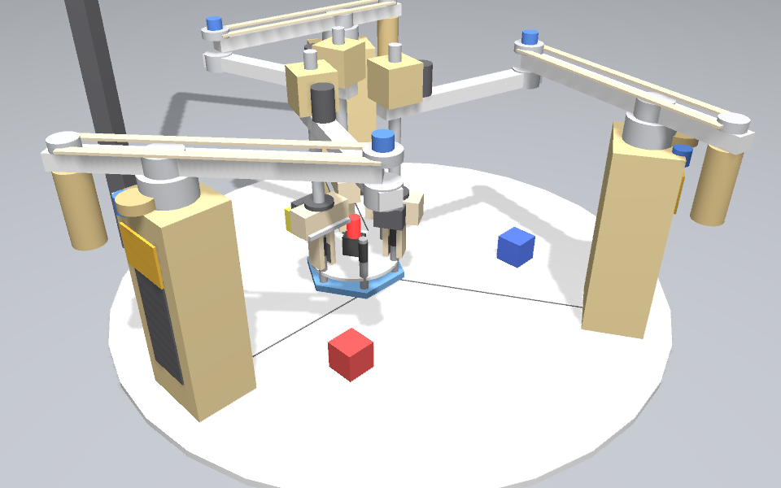<br>
  <sub>Left: the 2019 prototype. Right: the simulated cell in parallel mode, with all three grippers clamping the platform legs.</sub>
</p>

---

## Contents

1. [The idea in one minute](#1-the-idea-in-one-minute)
2. [What changed compared with the thesis](#2-what-changed-compared-with-the-thesis)
3. [Quick start](#3-quick-start)
4. [Simulation scenarios](#4-simulation-scenarios)
5. [System architecture](#5-system-architecture)
6. [Robot model and kinematics](#6-robot-model-and-kinematics)
7. [Serial and parallel modes](#7-serial-and-parallel-modes)
8. [Motion control and safety](#8-motion-control-and-safety)
9. [Vision: green obstacle detection](#9-vision-green-obstacle-detection)
10. [Real hardware (Raspberry Pi + ATmega)](#10-real-hardware-raspberry-pi--atmega)
11. [Testing](#11-testing)
12. [Workspace analysis](#12-workspace-analysis)
13. [Repository layout](#13-repository-layout)
14. [Troubleshooting](#14-troubleshooting)
15. [Known limitations](#15-known-limitations)
16. [Credits and citation](#16-credits-and-citation)

---

## 1. The idea in one minute

Three identical 2‑DOF SCARA arms stand on a 400 mm‑radius plate, 120° apart on a
320 mm circle. That circle is drawn on the prototype plate as the 277.13 mm / 160 mm marks.

* In **serial mode** every arm is an independent pick‑and‑place robot.
* In **parallel mode** two or three arms clamp the legs of a hexagonal platform.
  The legs sit on bearings, so each arm + leg forms an R‑R‑R chain, and the cell becomes a
  **redundantly actuated planar n‑RRR parallel manipulator**: 6 motors driving a 3‑DOF
  platform (x, y, yaw).
* A laser head in the middle of the platform draws or cuts paths. A camera looks for a
  green obstacle, and the path planner steers around it.

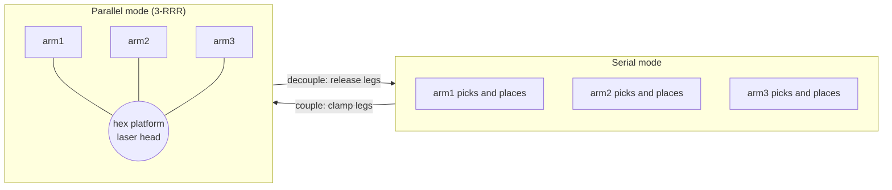

## 2. What changed compared with the thesis

| Topic | 2019 thesis / prototype | This workspace |
|---|---|---|
| Arm | 2‑DOF planar arm (J1, J2) + servo gripper | **4‑axis industrial SCARA**: J1, J2 (thesis) + J3 ball‑screw quill (Z) + J4 wrist + rack‑and‑pinion gripper |
| Geometry | 220 + 220 mm links, bases on a 320 mm circle, 60 mm hexagon | Same numbers, in one file: [`cell.yaml`](robocraft_ws/src/robocraft_description/config/cell.yaml) |
| Joint limits / drives | 12 V 50:1 DC motors, 42 kg·cm stall, pot feedback | Limits, efforts and speeds from those motors (±150°/±145°, 4 N·m, 30 rpm rated) |
| Kinematics | Mathematica / hand derivation | Tested Python library: FK, IK (both elbows), Jacobian, singularities, platform IK/FK |
| Trajectories | Two cubic segments through a via point (8×8 system, typo in one row) | Corrected thesis solver + synchronised PTP (quintic) + LIN (trapezoidal) with speed override |
| Multi‑arm safety | none | **Interference checker** (links, columns, grippers) with an interlock between concurrently moving arms |
| Grasping | friction grip, manual placement | Grasp is **verified**: attach only if the part is between the fingers |
| Platform lock | worm‑gear brake (concept) | `grasp_locked` = brake engaged, so one arm can carry *and* rotate the platform |
| Vision | OpenCV HSV threshold script | ROS node: same thesis pipeline + contour → pixel‑to‑world projection → obstacle messages |
| Communication | raw integer arrays over I²C (corruption observed) | Framed protocol with **CRC‑8** and sequence number; ros2_control hardware plugin |
| Firmware | P/PI loop, pots on A4/A5 (= I²C pins!), PWM on non‑PWM pins | Fixed pin map, PI with anti‑windup, watchdog, soft limits |
| Simulation | SolidWorks motion study | Gazebo Fortress physics, ros2_control, 6 scripted scenarios, cameras |

## 3. Quick start

Tested on **Ubuntu 22.04 + ROS 2 Humble + Gazebo Fortress (6.x)**.

### 3.1 Install dependencies

```bash
sudo apt install ros-humble-desktop ros-humble-ros-gz ros-humble-gz-ros2-control \
  ros-humble-ros2-control ros-humble-ros2-controllers ros-humble-xacro \
  ros-humble-joint-state-publisher-gui ros-humble-cv-bridge \
  ignition-fortress libignition-gazebo6-dev python3-opencv python3-pytest
```

### 3.2 Build

```bash
git clone https://github.com/basheeraltawil/Bachelor_of_Mechatronics_Engineering_Project.git
cd Bachelor_of_Mechatronics_Engineering_Project/robocraft_ws
source /opt/ros/humble/setup.bash
colcon build --symlink-install
source install/setup.bash
```

### 3.3 Run

```bash
# Gazebo + RViz, then start a scenario from a second terminal
ros2 launch robocraft_bringup sim.launch.py
ros2 run robocraft_control scenario reconfiguration_demo --ros-args -p use_sim_time:=true

# or do both in one command
ros2 launch robocraft_bringup sim.launch.py scenario:=parallel_square

# obstacle world (green block + camera vision)
ros2 launch robocraft_bringup sim.launch.py world:=obstacle scenario:=obstacle_square

# no physics, fastest: ros2_control mock hardware + RViz
ros2 launch robocraft_bringup mock.launch.py scenario:=pure_rotation

# look at the model only
ros2 launch robocraft_description display.launch.py
```

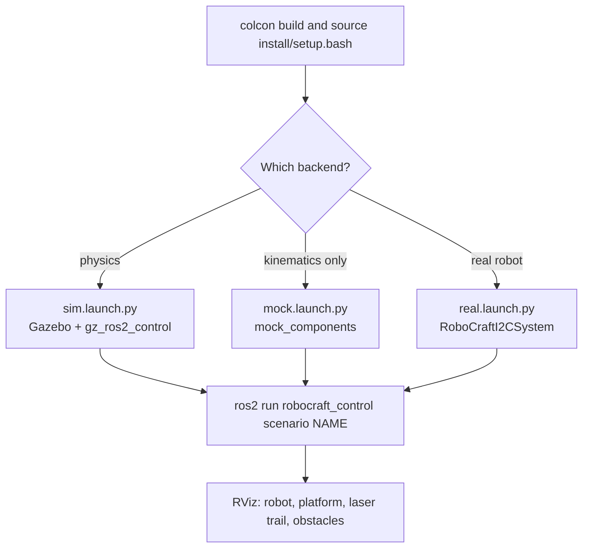

Useful launch arguments: `world:=cell|obstacle`, `headless:=true`, `rviz:=false`,
`vision:=false`, `speed_override:=0.3`, `showcase:=true` (bridges an extra oblique camera
for recording), `scenario:=...`, `scenario_args:="--side 0.1"`.

## 4. Simulation scenarios

Every scenario is one Python function in
[`scenarios/library.py`](robocraft_ws/src/robocraft_control/robocraft_control/scenarios/library.py).
The same code runs in the offline tests, on mock hardware, in Gazebo and on the real cell.

```bash
ros2 run robocraft_control scenario list
ros2 run robocraft_control scenario <name> [--key value ...] --ros-args -p use_sim_time:=true
```

| Scenario | Mode | Thesis | What happens | Main options |
|---|---|---|---|---|
| `serial_pick_place` | serial | 1.2 | All three arms pick their cube at the infeed and place it at the outfeed **at the same time**; the interlock serialises any motions that would collide | `--cycles 2 --concurrent true --arms arm1,arm2` |
| `parallel_square` | parallel | 5.3 | Arms clamp the platform, lift it 15 mm and the laser head draws a square by pure translation | `--side 0.12 --speed 0.03 --arms arm1,arm2` |
| `pure_rotation` | parallel | 5.2 | Two arms turn the platform 60°, the third takes over while the first two regrasp; 6 cycles = 360° | `--cycles 6 --step_deg 60` |
| `obstacle_square` | parallel | 5.4, 5.5 | The camera finds the green obstacle; square edges that pass too close are replaced by the thesis via‑point detour | `--side 0.12 --margin 0.02` |
| `locked_transport` | serial | 3.2 | One arm clamps a leg **with the brake engaged** and carries and rotates the platform on its own | `--arm arm1 --dx 0.04 --dyaw_deg 30` |
| `reconfiguration_demo` | both | 1.2 | Serial work → couple → square → handover rotation → decouple → serial work | – |

<p align="center">
  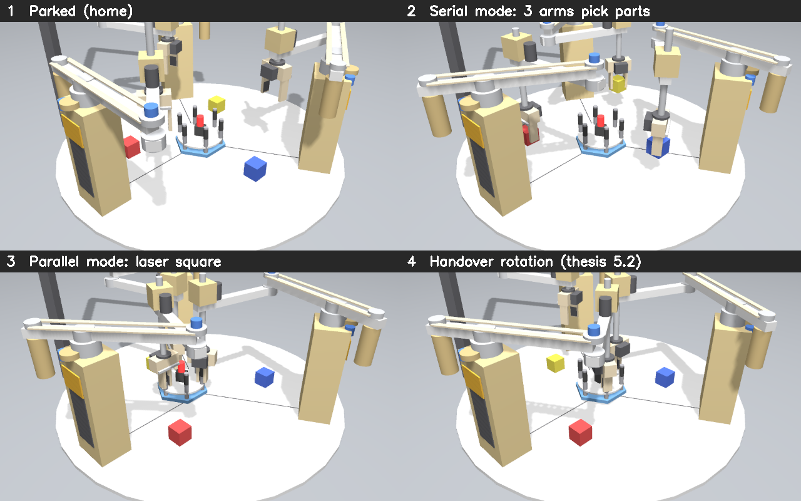
</p>

### Verified results (Gazebo physics, headless, 100 % speed override)

| Scenario | Result, measured on the Gazebo ground‑truth pose |
|---|---|
| `parallel_square` | platform traced **±60.0 mm**, lift 15 mm, yaw constant at 30.0° |
| `pure_rotation` (2 cycles) | yaw **30.0° → 150.0°**, XY drift < 0.1 mm, 6 regrasps each confirmed by the grasp sensor |
| `obstacle_square` | obstacle seen at (0.9, −109.0) mm, true position (0, −110) mm; 1 detour; laser stayed ≥ 73 mm from the obstacle centre |
| `serial_pick_place` | 3 arms running concurrently, every cube placed within 0.1 mm of its target |
| `locked_transport` | one locked arm moved the platform 40 mm and rotated it +30° and back |
| `reconfiguration_demo` | full cycle, cubes back at their start poses, no controller tolerance violations |

<p align="center">
  
</p>

## 5. System architecture

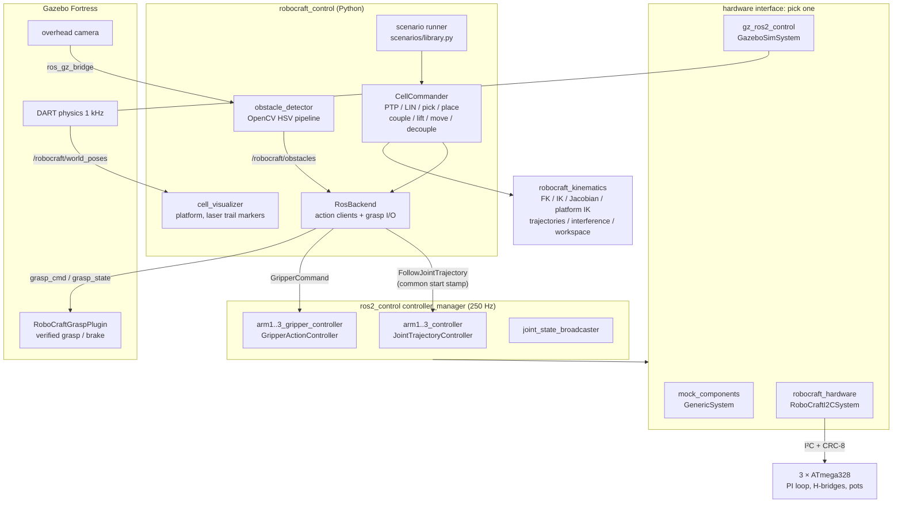

### Packages

| Package | Type | Content |
|---|---|---|
| [`robocraft_description`](robocraft_ws/src/robocraft_description) | ament_cmake | xacro model, `cell.yaml`, hex platform model, worlds, RViz config |
| [`robocraft_kinematics`](robocraft_ws/src/robocraft_kinematics) | ament_python | pure‑Python kinematics, trajectories, interference, workspace analysis, protocol codec |
| [`robocraft_control`](robocraft_ws/src/robocraft_control) | ament_python | commander, ROS backend, scenarios, vision, visualiser |
| [`robocraft_bringup`](robocraft_ws/src/robocraft_bringup) | ament_cmake | launch files, controller configs, Gazebo bridge |
| [`robocraft_gz_plugins`](robocraft_ws/src/robocraft_gz_plugins) | ament_cmake (C++) | Gazebo system plugin for verified grasping and the brake |
| [`robocraft_hardware`](robocraft_ws/src/robocraft_hardware) | ament_cmake (C++) | ros2_control I²C hardware interface + ATmega firmware |
| [`robocraft_interfaces`](robocraft_ws/src/robocraft_interfaces) | rosidl | `Obstacle`, `ObstacleArray`, `CellStatus` |

### Main topics and actions

| Name | Type | Purpose |
|---|---|---|
| `/armN_controller/follow_joint_trajectory` | action | J1–J4 trajectories |
| `/armN_gripper_controller/gripper_cmd` | action | finger opening (m) |
| `/robocraft/armN/grasp_cmd`, `.../grasp_state` | `std_msgs/String` | `grasp`, `grasp_locked`, `release` / `holding:...` |
| `/robocraft/obstacles` | `robocraft_interfaces/ObstacleArray` | vision output in world coordinates |
| `/robocraft/status` | `robocraft_interfaces/CellStatus` | mode, grasp states, closure error, interference margin |
| `/robocraft/laser` | `std_msgs/Bool` | laser on/off (drives the trail in RViz) |
| `/robocraft/markers` | `MarkerArray` | platform, legs, laser trail, obstacles |

## 6. Robot model and kinematics

### 6.1 Geometry

All numbers live in [`cell.yaml`](robocraft_ws/src/robocraft_description/config/cell.yaml).
The xacro model, the kinematics library and the nodes all read that file.

| | Value | Source |
|---|---|---|
| Link lengths a, b | 220 mm, 220 mm | thesis 2.1 |
| Base positions | (0, −320), (277.13, 160), (−277.13, 160) mm | thesis code + plate markings |
| Column | 100 × 80 mm, J1 axis at z = 300 mm | thesis 3 |
| Motor 2 | 100 mm behind J1 (counterweight), belt drive to the elbow | thesis 3 |
| Platform | legs on a 60 mm radius, 12 mm steel shafts, brake plate | thesis 3.2 |
| J1 / J2 limits | ±150° / ±145°, 3.14 rad/s, 4 N·m | DC motor data, thesis 4.1 |
| J3 quill / J4 wrist | 170 mm, 0.2 m/s / ±360° | industrial extension |

<p align="center">
  <br>
  <sub>Thesis CAD design. The simulated model follows it: rear motor 2, belt, helical gears, hollow column.</sub>
</p>

### 6.2 Equations

Each arm column is rotated so that joint zero points at the cell centre
(θ₁ = ψᵢ + q₁, with ψᵢ the base yaw):

```
x = xᵢ + a·cos θ₁ + b·cos(θ₁ + q₂)                 (thesis 2.2.2)
y = yᵢ + a·sin θ₁ + b·sin(θ₁ + q₂)
z = z_TCP0 − q₃                                     (quill)
yaw_tool = ψᵢ + q₁ + q₂ + q₄                        (wrist)

cos q₂ = (r² − a² − b²) / (2ab)      → two elbow solutions  (thesis 2.2.4)
det J  = a·b·sin q₂  → singular when the arm is stretched or folded (thesis 2.2.3)
```

For the **platform** (x, y, φ), leg k is at `p + R(φ)·ρ·[cos 60k°, sin 60k°]`
(ρ = 60 mm). Each clamping arm solves its serial IK to its leg. The forward kinematics of the
platform is a least‑squares rigid fit through the gripper positions; the fit residual (the
**closure error**) is published as a health signal for the redundant actuation.

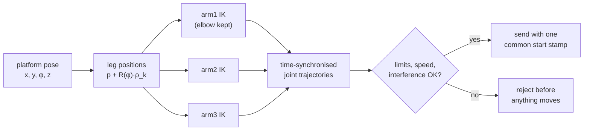

## 7. Serial and parallel modes

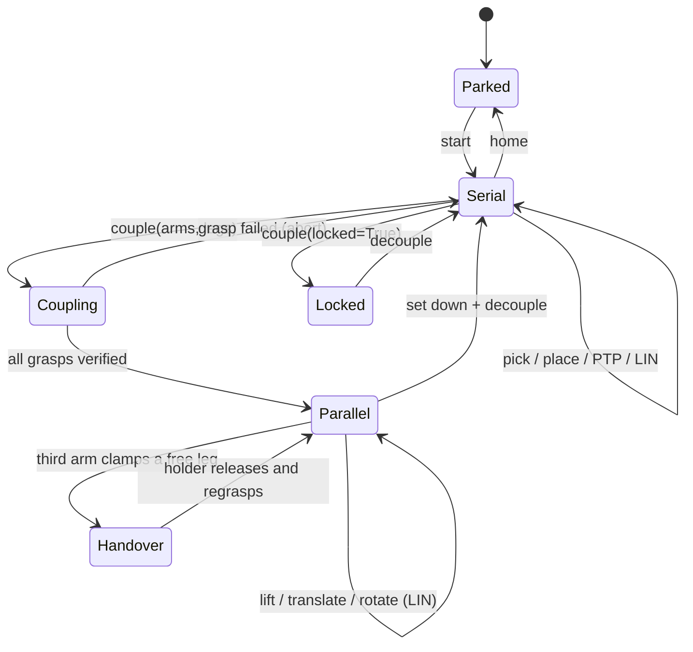

**Handover rotation** (thesis 5.2). Each gripper's long axis is turned **radially** by J4, so
grippers on neighbouring legs (60 mm apart) do not touch:

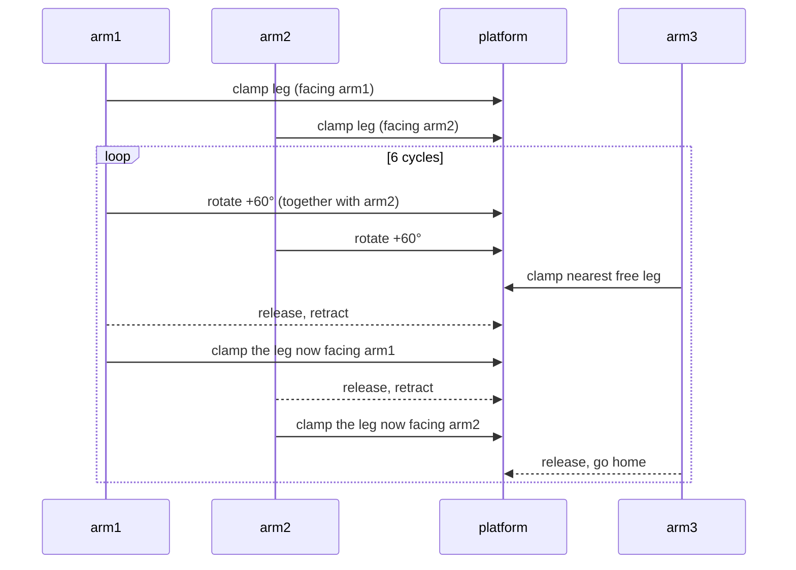

## 8. Motion control and safety

* **PTP**: synchronised quintic profiles. The slowest joint sets the duration and all joints
  finish together (industrial PTP).
* **LIN**: straight Cartesian lines with a trapezoidal speed profile. The elbow configuration
  stays fixed, as on an industrial controller. If any joint would exceed its speed limit the
  whole motion is slowed down.
* **Thesis via point**: the via point is where two circles of radius (W/2)/cos θ meet, with
  θ = 30° by default. The corrected 8×8 two‑segment cubic is in `trajectory.py`.
* **Speed override** (`speed_override`, 0–1) scales every motion, like the override knob
  on a teach pendant.
* **Interference checking**: every sample of every plan is checked against the other arms.
  Links on the same height layer, link 2 against other columns and motors, grippers as
  oriented capsules. For arms moving in parallel threads, a zone interlock waits until the
  other arm is out of the way.
* **Synchronised start**: parallel moves are sent to all arm controllers with one
  `header.stamp`, so they start in the same control cycle.
* **Gazebo drives**: J1–J4 take velocity commands. The trajectory controller closes the
  position loop (P + velocity feed‑forward), like a servo drive in velocity mode.

## 9. Vision: green obstacle detection

<p align="center">
  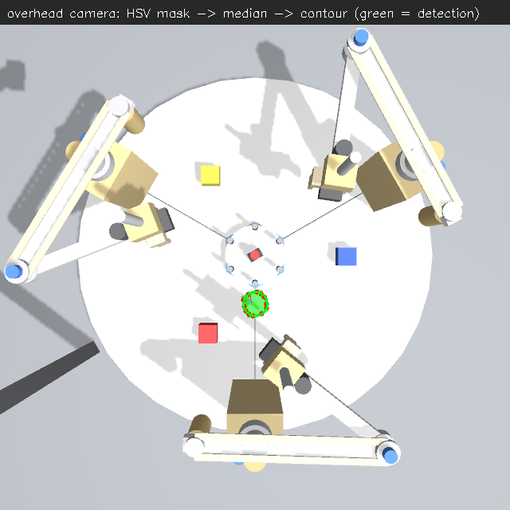
</p>

`obstacle_detector` keeps the thesis pipeline (§5.5) and adds a projection to world coordinates:

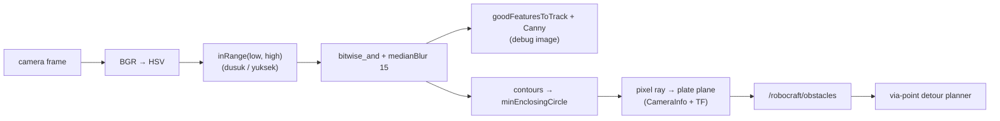

The HSV range, blur size, minimum blob area and plane height are ROS parameters. To
detect a different colour, change `hsv_low` / `hsv_high`.

## 10. Real hardware (Raspberry Pi + ATmega)

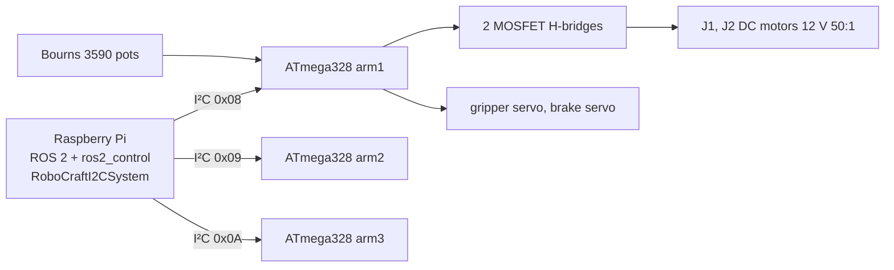

**Frame format** (same in Python, C++ and firmware):

| Direction | Bytes |
|---|---|
| Pi → ATmega (9 B) | `0xA5, seq, q1(int16 centi‑deg), q2(int16), gripper°, flags(enable/brake/clear), CRC‑8` |
| ATmega → Pi (8 B) | `0x5A, seq, q1, q2, status(enabled/fault/watchdog/at_target), CRC‑8` |

Bugs found in the original appendix sketch and fixed in
[`robocraft_joint_firmware.ino`](robocraft_ws/src/robocraft_hardware/firmware/robocraft_joint_firmware/robocraft_joint_firmware.ino):

* Potentiometers were read on **A4/A5**, which are SDA/SCL on the ATmega328, the same pins as the I²C bus. They now use A0/A1.
* `analogWrite` went to pins **7 and 8**, which have no PWM hardware. Motors now use 5/6 and 3/11; the servos use Timer1 pins 9/10.
* The thesis saw corrupted I²C data (§4.3.3). Frames are now CRC‑checked and a bad frame is ignored instead of executed.
* A 250 ms watchdog stops the motors if the Pi stops talking.

**Commissioning checklist**

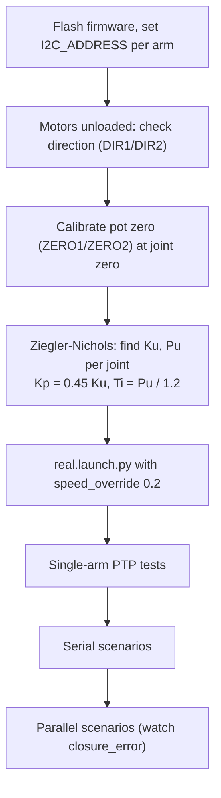

```bash
ros2 launch robocraft_bringup real.launch.py i2c_device:=/dev/i2c-1 i2c_addresses:=8,9,10
ros2 run robocraft_control scenario serial_pick_place --ros-args -p grasp_mode:=simulated -p speed_override:=0.2
```

The 2019 prototype has no J3/J4 hardware. The driver simulates those axes
(`virtual_joints:=joint3,joint4`), so every scenario still runs.

## 11. Testing

```bash
cd robocraft_ws
colcon test && colcon test-result --verbose     # 29 tests
```

| Suite | What it covers |
|---|---|
| `robocraft_kinematics/test` | thesis FK formula, IK round trips (600 random poses), singularities, platform IK/FK, thesis via‑point geometry, cubic continuity, protocol CRC |
| `robocraft_control/test/test_scenarios_dry_run.py` | **every scenario** planned and "executed" offline: reachability, joint limits, joint speeds, interference, final parking |
| `robocraft_control/test/test_vision.py` | green detection on a synthetic image |
| `robocraft_hardware/test` | C++ frame encoder/decoder, CRC check value |

## 12. Workspace analysis

```bash
ros2 run robocraft_kinematics workspace_analysis --plot workspace.png
```

<p align="center">
  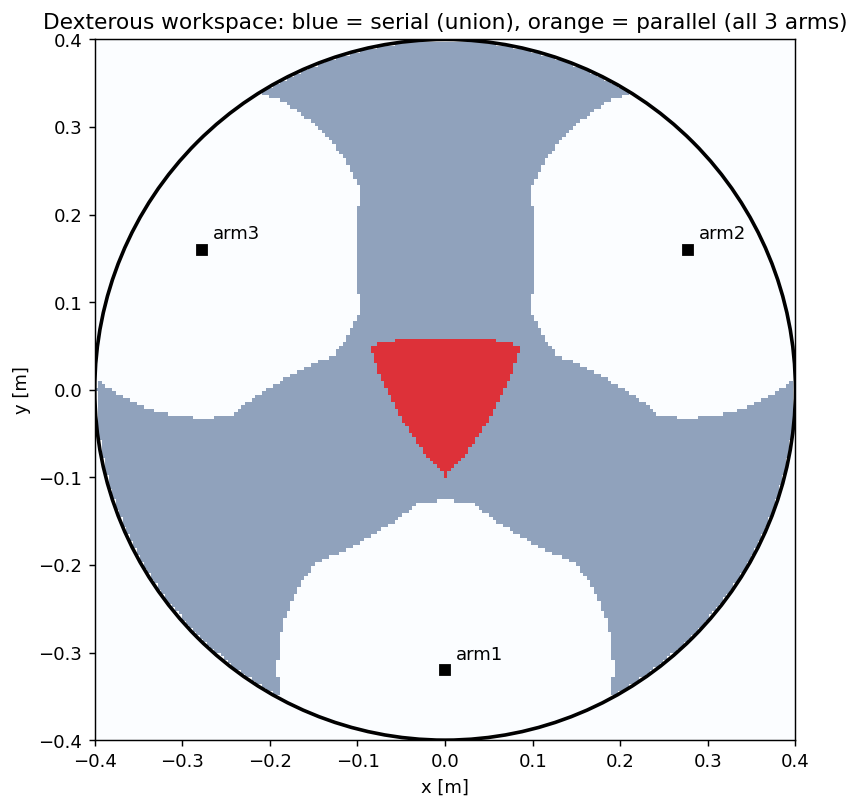
</p>

"Dexterous" means the thesis definition: the platform can turn a full 360° there while the
arm keeps holding a leg. With the real joint limits included:

| | Area | PC1 = area / (0.8·π·400²) |
|---|---|---|
| serial, union of the 3 arms | 264 656 mm² | 0.66 |
| parallel, all 3 arms hold the platform | 16 384 mm² | 0.04 |
| thesis value | 383 438 mm² | 0.95 |

The thesis figure was measured in SolidWorks without joint limits and without the
full‑rotation condition, so it is larger. Parallel mode normally uses a *fixed* orientation,
and its reachable region is much bigger than the full‑rotation area above.

## 13. Repository layout

```
.
├── README.md                     ← this file
├── robocraft_repo/               ← original 2019 material (thesis PDF/MD, code appendix, figures, legacy code)
└── robocraft_ws/                 ← ROS 2 workspace
    ├── docs/images/              ← figures and GIF used in this README
    └── src/
        ├── robocraft_description/   urdf/ (cell, arm, ros2_control xacro), config/cell.yaml,
        │                            models/hex_platform, worlds/, rviz/, launch/display.launch.py
        ├── robocraft_kinematics/    geometry, scara, parallel, trajectory, via_point,
        │                            interference, workspace, protocol + tests
        ├── robocraft_control/       commander, backend, ros_backend, scenario_runner,
        │                            scenarios/library.py, obstacle_detector, cell_visualizer + tests
        ├── robocraft_bringup/       launch/{sim,mock,real}.launch.py,
        │                            config/{controllers*.yaml, gz_bridge.yaml, generate_controllers.py}
        ├── robocraft_gz_plugins/    src/GraspPlugin.cc
        ├── robocraft_hardware/      src/robocraft_i2c_system.cpp, firmware/, tests
        └── robocraft_interfaces/    msg/{Obstacle, ObstacleArray, CellStatus}
```

## 14. Troubleshooting

| Symptom | Fix |
|---|---|
| Several ROS/Gazebo projects on one PC see each other's topics | Give each one its own `export ROS_DOMAIN_ID=77` and `export IGN_PARTITION=robocraft` |
| `gripper goal rejected` / action timeouts | Too much image traffic on DDS: keep `showcase:=false`, or lower the camera resolution in the world file |
| Controllers never come up | `gz_ros2_control` needs `robot_state_publisher` running; the launch file waits 3 s before spawning. Increase that on slow machines |
| Cubes or platform sunk into the plate | Use the worlds from this repo: `plate_support` keeps objects at plate height before the robot spawns |
| `ros2 control list_controllers` hangs | Stale CLI daemon: `ros2 daemon stop` |
| Changed controller settings | Edit `generate_controllers.py`, then run it in `robocraft_bringup/config` |

## 15. Known limitations

* A grasp is modelled as a fixed joint that is created only when the object is between the fingers.
  The finger pads have no collision shapes, so friction grasping is not simulated.
* The Gazebo runs above were done **headless**. The GUI launch uses the same files but was
  not checked visually here.
* The firmware PI gains (`KU`, `PU`) are placeholders until they are identified on the hardware.
* The C++ I²C driver is compiled and unit‑tested, but it has not been run against a physical ATmega yet.
* No MoveIt configuration: the cell uses its own closed‑form planner. MoveIt would be a natural next step
  for general obstacle‑aware planning.

## 16. Credits and citation

* **Graduation project (2019):** *Development of a multi degrees of freedom redundant reconfigurable
  planar parallel manipulator with 2 DOF planar detachable serial dyads.* Basheer Al‑Tawil,
  Saran Sapmaz, Esra Uçar, Adem Candemir. Supervisor: Assist. Prof. Dr. Osman Akın.
  İzmir Kâtip Çelebi University, Mechatronics Engineering.
* Thesis: [`robocraft_repo/docs/graduation project thesis.pdf`](robocraft_repo/docs/graduation%20project%20thesis.pdf).
  Code appendix: [`robocraft_repo/docs/codesappendix.pdf`](robocraft_repo/docs/codesappendix.pdf).
  Legacy code: [`robocraft_repo/src`](robocraft_repo/src), described in [`CODE_ORIGIN.md`](robocraft_repo/docs/CODE_ORIGIN.md).
* ROS 2 workspace (2026): rebuild and industrial extension of the original project.

If you use this work, please cite the graduation project and mention the ROS 2 workspace.
