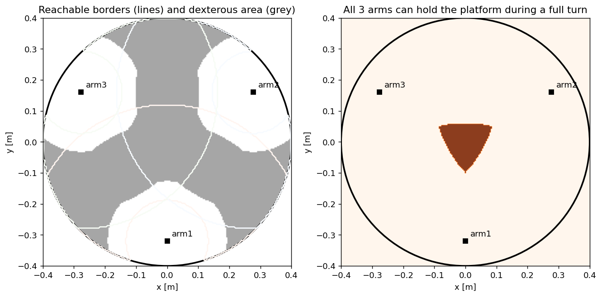
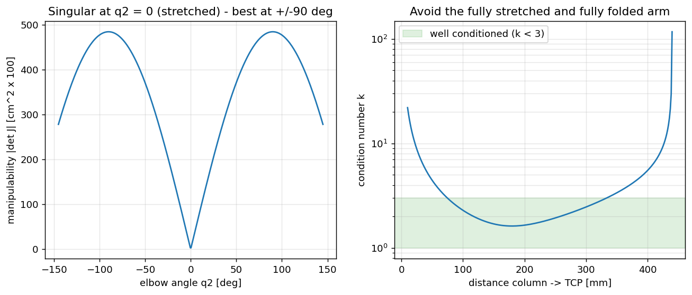
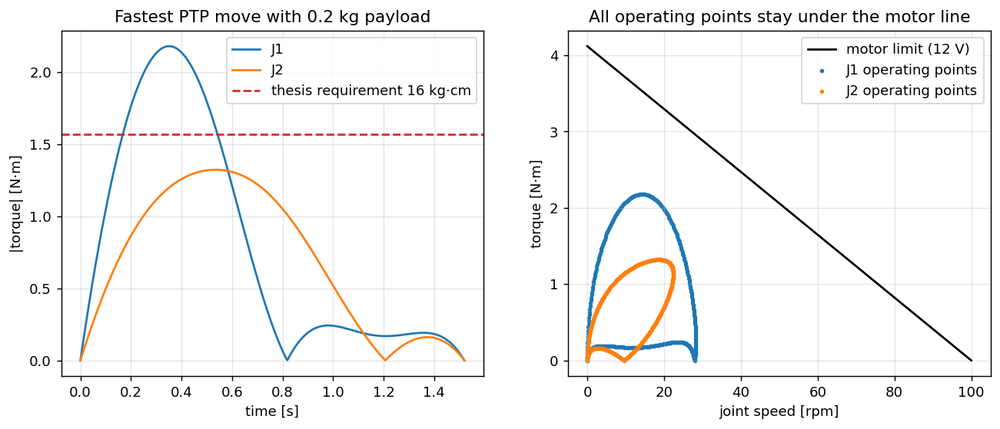
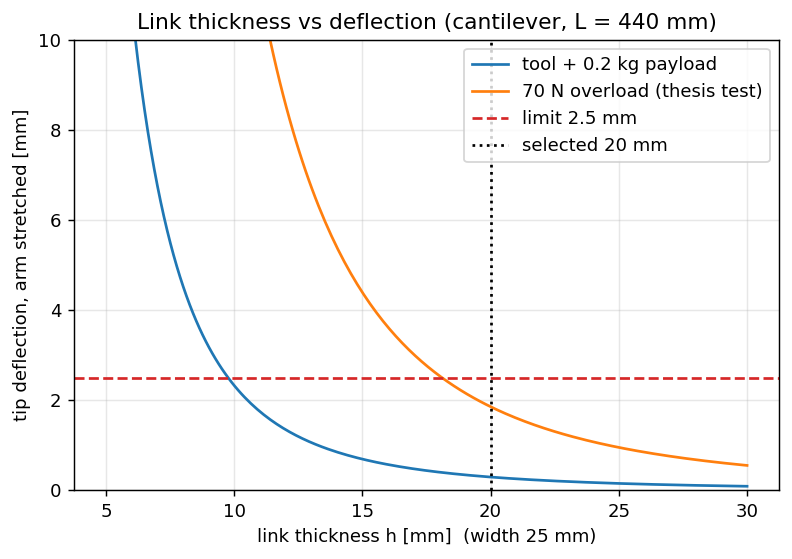
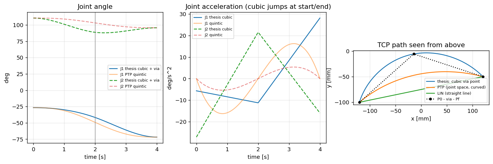
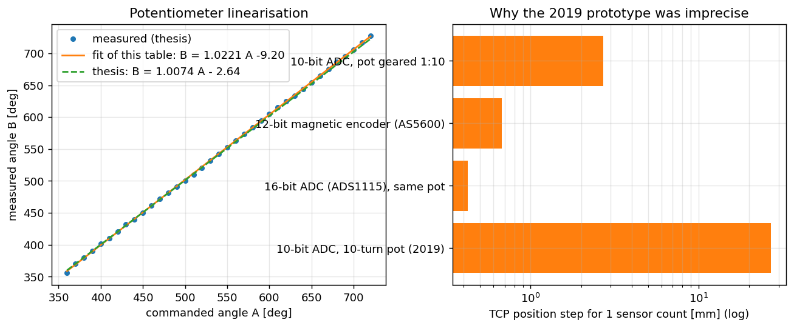
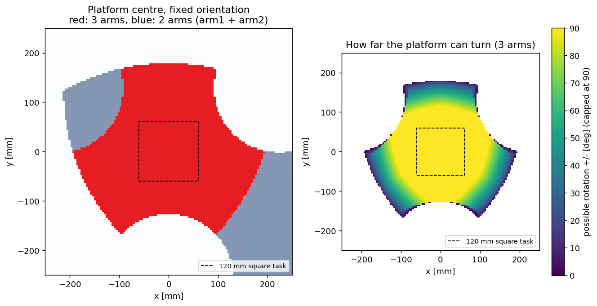

# Engineering analysis

Eight short scripts reproduce and extend the calculations of the 2019 thesis. Each
script is standalone and readable: its header explains the method and the
formulas, it prints the numbers and saves a figure to
[`docs/images/analysis/`](../docs/images/analysis).

```bash
pip install numpy matplotlib pyyaml        # ROS is not needed
python3 analysis/run_all.py                # all scripts -> analysis/results.txt
python3 analysis/03_dynamics_motor_sizing.py   # or a single one
```

All scripts read the same robot data as the simulation
([`cell.yaml`](../robocraft_ws/src/robocraft_description/config/cell.yaml)) and reuse the
tested kinematics library, so the numbers stay consistent with the ROS model.

| # | Script | Question it answers | Key result |
|---|---|---|---|
| 01 | [`01_workspace.py`](01_workspace.py) | Where can the arms reach? | serial dexterous area 264 656 mm² (PC1 0.66) |
| 02 | [`02_kinematics.py`](02_kinematics.py) | Are FK/IK right? Where are singularities? | FK↔IK error < 1e‑14 rad; best reach 75–332 mm from the column |
| 03 | [`03_dynamics_motor_sizing.py`](03_dynamics_motor_sizing.py) | Is the motor strong enough? | peak 2.18 N·m at full speed; motor margin ×1.6 |
| 04 | [`04_link_deflection.py`](04_link_deflection.py) | Do the links meet the 2.5 mm limit? | 0.29 mm normal, 1.85 mm at the 70 N test |
| 05 | [`05_trajectory_planning.py`](05_trajectory_planning.py) | How do the thesis trajectories compare with industrial ones? | the cubic jumps in acceleration; the quintic does not |
| 06 | [`06_sensor_calibration.py`](06_sensor_calibration.py) | How accurate is the position sensor? | 3.5° per ADC count = **27 mm** at the tip |
| 07 | [`07_motor_control_tuning.py`](07_motor_control_tuning.py) | Which controller gains? | feed-forward cuts the tracking error from 5.2° to 0.75° |
| 08 | [`08_parallel_workspace.py`](08_parallel_workspace.py) | Where can the platform go? | 86 752 mm² with 3 arms, ±90° rotation in the centre |

---

## 01 Workspace

A point is **reachable** if the inverse kinematics has a solution inside the joint limits:

$$\cos q_2 = \frac{r^2 - a^2 - b^2}{2ab}, \qquad |\cos q_2| \le 1$$

A point is **dexterous** (thesis definition) if the whole 60 mm circle around it is
reachable, so the arm can hold a platform leg while the platform turns 360°. The thesis
performance measure is

$$PC_1 = \frac{A_\text{dexterous}}{0.8\,\pi\,R_\text{plate}^2}, \qquad R_\text{plate} = 400\ \text{mm}$$

**Result:** with the real joint limits, PC1 = 0.66 for the serial arms. The thesis reports
0.95; that SolidWorks value had no joint limits.



## 02 Kinematics and singularities

$$x = x_i + a\cos\theta_1 + b\cos(\theta_1+q_2), \quad y = y_i + a\sin\theta_1 + b\sin(\theta_1+q_2)$$

$$J = \begin{bmatrix} -a s_1 - b s_{12} & -b s_{12} \\ a c_1 + b c_{12} & b c_{12}\end{bmatrix},
\qquad \det J = ab\sin q_2$$

The arm is singular when it is stretched ($q_2 = 0$) or folded ($q_2 = 180°$). The
manipulability $w = |\det J|$ is highest with the elbow at 90°. The condition number
$\kappa = \sigma_\max / \sigma_\min$ stays below 3 between 75 mm and 332 mm from the column,
so parts and tasks are placed in that band.



## 03 Dynamics and motor sizing

Lagrange equations of the 2‑link arm (thesis 2.3). Link 2 carries the quill, the gripper and
the 0.2 kg payload:

$$\begin{aligned}
\tau_1 &= M_{11}\ddot q_1 + M_{12}\ddot q_2 - h(2\dot q_1\dot q_2 + \dot q_2^2) + d_1\dot q_1\\
\tau_2 &= M_{12}\ddot q_1 + M_{22}\ddot q_2 + h\dot q_1^2 + d_2\dot q_2\\
M_{11} &= I_1 + I_2 + m_1c_1^2 + m_2(a^2 + c_2^2 + 2ac_2\cos q_2),\quad h = m_2 a c_2 \sin q_2
\end{aligned}$$

The motor's available torque falls with speed: $\tau_\max(\omega) = \tau_s(1-\omega/\omega_0)$,
with $\tau_s$ = 42 kg·cm and $\omega_0$ = 100 rpm.

**Result:** the fastest allowed move needs 2.18 N·m on J1. That is more than the 16 kg·cm
(1.57 N·m) estimated in the thesis, but every operating point stays below the motor line with
a margin of ×1.6. Because the SCARA axes are vertical, gravity loads the bearings rather than
J1/J2: the J1 bearing pair carries a bending moment of 5.3 N·m.



## 04 Link deflection

The stretched arm (L = 440 mm) is modelled as an aluminium cantilever:

$$\delta = \frac{F L^3}{3EI} + \frac{w L^4}{8EI}, \qquad I = \frac{b h^3}{12}, \qquad
\sigma = \frac{M\,h/2}{I}$$

**Result:** with the 25 × 20 mm links the tip deflects 0.29 mm under normal load and 1.85 mm
in the thesis 70 N overload test. Both are inside the 2.5 mm limit. A 10 mm link would already
pass under normal load, so the 20 mm choice is conservative and stiff.



## 05 Trajectory planning

**Thesis method:** a via point at the intersection of two circles of radius
$L = \frac{W/2}{\cos\theta}$ ($\theta$ = 30°), then two cubic segments per joint. That gives
8 conditions and an 8×8 linear system (the corrected version is in `trajectory.py`).

**Industrial PTP:** a quintic $s(u) = 10u^3 - 15u^4 + 6u^5$ starts and stops with zero
velocity *and* zero acceleration. **LIN** moves the TCP along a straight line with a
trapezoidal speed profile.



## 06 Position sensor

The 10‑turn potentiometer is read by a 10‑bit ADC:

$$\Delta q = \frac{3600°}{1023} = 3.52° \quad\Rightarrow\quad \Delta x = (a+b)\,\Delta q \approx 27\ \text{mm}$$

**Result:** this single number explains most of the positioning error of the 2019 prototype.
A 16‑bit ADC (0.4 mm) or a 12‑bit magnetic encoder (0.7 mm) fixes it cheaply. The
calibration line from the thesis data is also reproduced.



## 07 Motor model and controller tuning

The motor model comes from the datasheet ($K_t = V/\omega_0$, $R = V K_t/\tau_s$). The plant,
including a 20 ms dead time, is

$$G(s) = \frac{K\,e^{-sT_d}}{s(\tau s + 1)}$$

Ziegler–Nichols (thesis 4.3) uses the ultimate gain $K_u = 1/|G(j\omega_u)|$ at the
frequency where the phase is −180°. From it: P $K_p = 0.5K_u$; PI $0.45K_u,\ T_i = P_u/1.2$;
PID $0.6K_u,\ P_u/2,\ P_u/8$.

**Result:** $K_u$ ≈ 44 PWM/deg and $P_u$ ≈ 0.37 s for J1; these now seed the firmware.
Classical ZN overshoots a step by 30–50 %. The robot is commanded with smooth trajectories,
though, and there **feed-forward** $u_{ff} = \omega_r/K + (JR/K_t)\alpha_r$ lowers the tracking
error from 5.2° to 0.75°.


## 08 Parallel-mode workspace

The platform centre $p$ is feasible when every clamping arm reaches its leg
$p + R(\varphi)\,\rho\,[\cos 60k°, \sin 60k°]$ inside its joint limits.

**Result:** at a fixed orientation the platform can move over 86 752 mm² with three arms
(128 048 mm² with two). Near the centre it can turn at least ±90°, which is why the scenarios
use tasks of about 120 mm.


