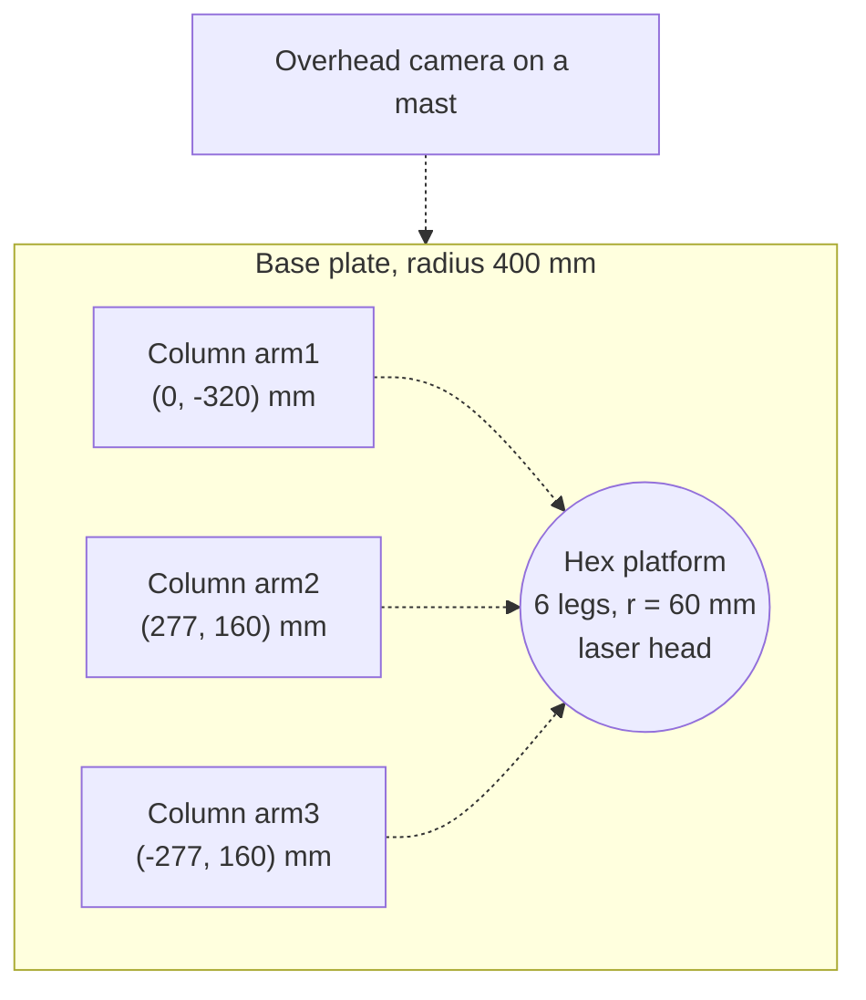
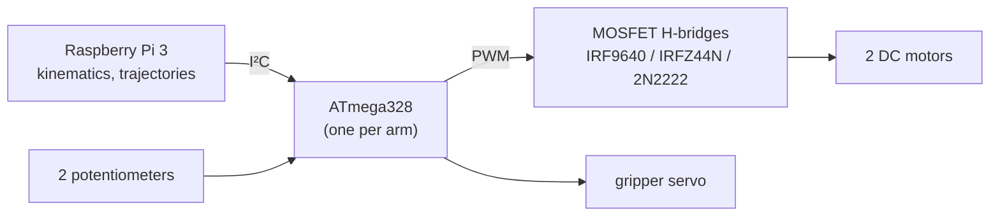

# 1. Design

RoboCraft is a **reconfigurable robot cell**: three identical SCARA arms that can work alone
or join together through a hexagonal platform. This page summarises the 2019 design
decisions and the changes made to bring the design closer to an industrial robot.

  
  

## 1.1 Requirements (thesis)

| Requirement | Value |
|---|---|
| Structure | 3 identical 2‑DOF serial arms, usable alone or as one parallel robot |
| Footprint | cell fits in a circle of 400 mm radius (most compact pose) |
| Payload | at least 0.2 kg |
| Stiffness | tip deflection ≤ 2.5 mm |
| Actuators | DC motors only, with own position feedback (no ready servo drives) |
| Tasks | platform rotation, drawing/cutting a square, avoiding a green obstacle |

## 1.2 Layout

* The columns stand 120° apart on a 320 mm circle; the 277.13 / 160 mm marks are drawn on the real plate.
* **Link lengths 220 + 220 mm.** The thesis chose them iteratively to maximise the area that all three
  arms share while respecting the footprint limit (see [analysis/01](../analysis/README.md#01-workspace)).

## 1.3 One arm

| Part | Design decision | Why |
|---|---|---|
| Column | hollow 100 × 80 mm box, motor 1 inside | protects the electronics, keeps the workspace free |
| J1 drive | 12 V 50:1 DC gear motor, helical gears 1.5M‑25T | helical gears have less backlash than spur gears, important for pot feedback |
| J1 bearings | two 17 mm deep‑groove bearings in a housing | carry the bending moment of the arm (5.3 N·m, [analysis/03](../analysis/README.md#03-dynamics-and-motor-sizing)) |
| Link 1 | aluminium 25 × 20 mm, 220 mm | 20 mm from a SolidWorks static study; deflection 0.29 mm ([analysis/04](../analysis/README.md#04-link-deflection)) |
| Motor 2 | mounted **behind** J1 on link 1, belt to the elbow | moves the centre of mass towards J1 and lowers the J1 torque |
| Position sensor | Bourns 3590 10‑turn potentiometer per joint | no encoders allowed; linearised by calibration ([analysis/06](../analysis/README.md#06-position-sensor)) |
| Gripper | 3D‑printed, rack and pinion, servo | fingers move in a straight line, so the grip point does not shift |

## 1.4 Hexagonal platform and lock

* 3D‑printed plates with **six steel shafts (legs)** on ball bearings. Every arm clamps one leg.
* A leg bearing is a **passive revolute joint**, so arm + leg form an R‑R‑R chain. With 2 or 3
  arms the platform becomes a planar parallel manipulator with 3 DOF (x, y, rotation) driven by
  4 or 6 motors: it is **redundantly actuated**.
* **Lock (brake):** a worm gear and servo push the upper plate onto the legs with rubber pads.
  With the brake on, a single arm holds the platform rigidly and can carry it alone.
* A laser head in the centre marks or cuts the path.

## 1.5 Electronics (2019)

The H-bridges were designed, etched and soldered by the team. Complementary P/N MOSFET
pairs replaced an all‑N design that lost too much voltage. A PIC 16F877A version was
abandoned after I²C data errors, and the ATmega version was used instead.

## 1.6 What was changed to make it industrial

| 2019 | Now | Benefit |
|---|---|---|
| 2 axes + gripper | **4 axes**: added J3 Z quill (ball screw) and J4 wrist | picks from above, orients the gripper; standard SCARA layout (Epson, Fanuc, ABB) |
| gripper holds the platform leg from the side | gripper descends vertically and clamps the leg, with a sensor-verified grasp | repeatable coupling |
| positions sent as raw numbers | framed messages with CRC‑8, a watchdog and fault states | a corrupted message can never move a motor |
| hand-tuned P/PI | model‑based gains + velocity feed‑forward | tracking error 5° → 0.75° ([analysis/07](../analysis/README.md#07-motor-model-and-controller-tuning)) |
| no collision logic | every motion is checked for collisions between arms; arms wait for each other | three robots can share one table safely |
| scripts per task | one command language (PTP, LIN, pick, place, couple, ...) and reusable scenarios | new tasks in a few lines |
| 10‑bit potentiometer | recommended 16‑bit ADC or 12‑bit magnetic encoder | 27 mm → below 1 mm position resolution |

Dimensions, masses and limits of the model: [`cell.yaml`](../robocraft_ws/src/robocraft_description/config/cell.yaml).
The full 2019 report: [`thesis_2019/`](../thesis_2019).
