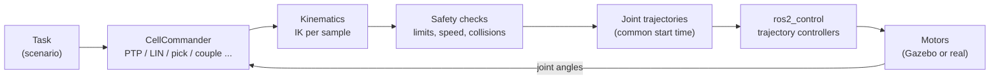
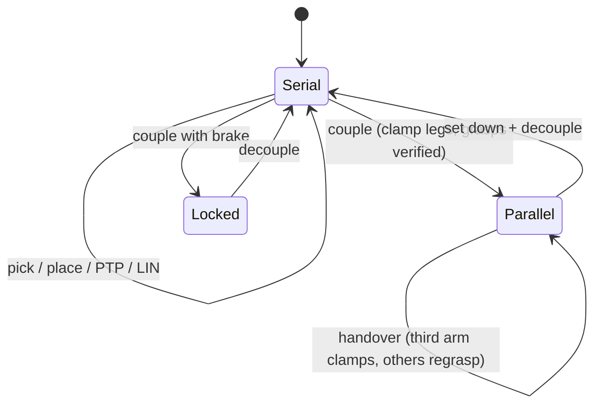
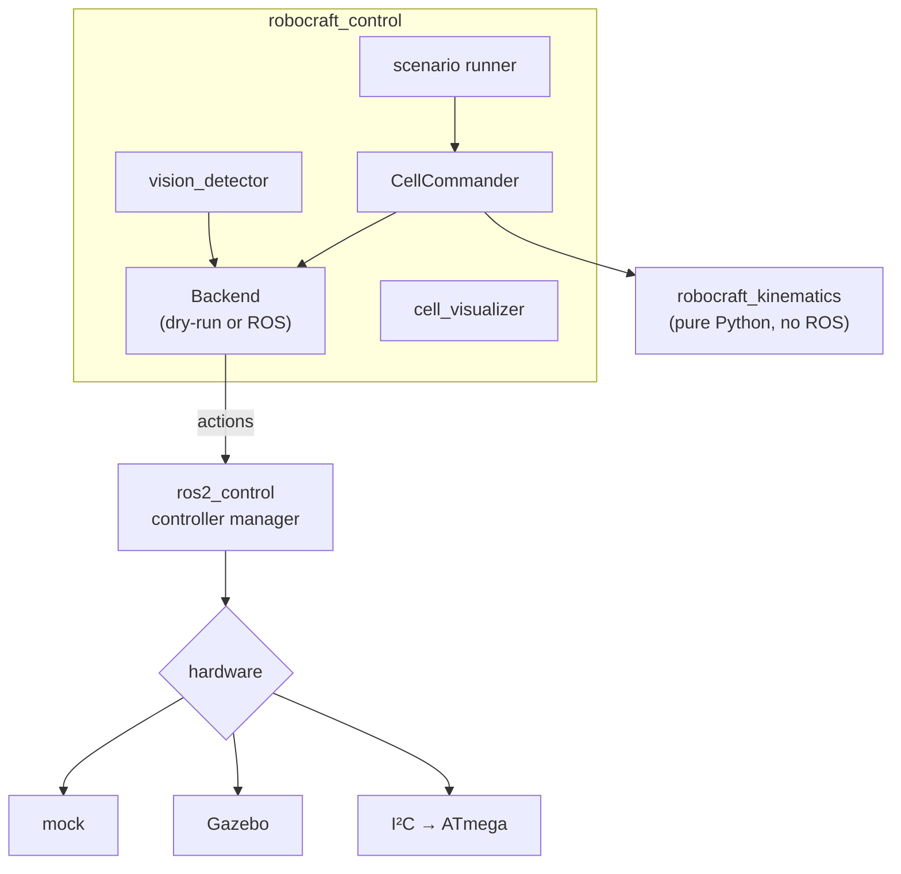

# 2. Kinematics and control

How a desired motion ("put the part there", "cut this contour") becomes motor commands.
The formulas are checked numerically in the [analysis scripts](../analysis/README.md).

## 2.1 One arm (serial kinematics)

Each arm has joints q = (q₁, q₂, q₃, q₄): shoulder, elbow, quill (down) and wrist.
The column at (xᵢ, yᵢ) is turned so that q₁ = 0 points at the cell centre (base yaw ψᵢ).

**Forward kinematics** gives the tool position from the joint angles (θ₁ = ψᵢ + q₁):

$$x = x_i + a\cos\theta_1 + b\cos(\theta_1 + q_2),\qquad y = y_i + a\sin\theta_1 + b\sin(\theta_1+q_2)$$
$$z = z_0 - q_3,\qquad \text{tool yaw} = \theta_1 + q_2 + q_4$$

**Inverse kinematics** gives the joint angles from the tool position (thesis 2.2.4):
$$\cos q_2 = \frac{r^2 - a^2 - b^2}{2ab},\qquad q_1 = \text{atan2}(\Delta y, \Delta x) - \text{atan2}(b\sin q_2,\ a + b\cos q_2) - \psi_i$$

There are two solutions (elbow left / right). During a straight‑line move the elbow side is kept,
as on an industrial controller, so the arm never flips unexpectedly.

**Singularities:** $\det J = ab\sin q_2 = 0$ when the arm is fully stretched or folded. There the
arm cannot move in one direction, so tasks are placed 75–332 mm from the column.

Code: [`scara.py`](../robocraft_ws/src/robocraft_kinematics/robocraft_kinematics/scara.py)

## 2.2 Platform (parallel kinematics)

With the platform at pose $(x,y,\varphi)$, leg $k$ ($k=0,\dots,5$) is at

$$\mathbf p_k = \begin{bmatrix}x\\y\end{bmatrix} + R(\varphi)\,\rho\begin{bmatrix}\cos 60k°\\ \sin 60k°\end{bmatrix},\qquad \rho = 60\ \text{mm}, \qquad R(\varphi) = \begin{bmatrix}\cos\varphi & -\sin\varphi\\ \sin\varphi & \cos\varphi\end{bmatrix}$$

* **Inverse kinematics (easy):** compute every leg position, then each arm solves its own IK to its leg.

* **Forward kinematics:** a least-squares rigid fit of the platform through the measured gripper positions. With local leg layout $L$ and measured world positions $W$ (centroids $\bar L,\bar W$):
$$H = (L-\bar L)^T(W-\bar W), \qquad \varphi = \text{atan2}(H_{12}-H_{21},\ H_{11}+H_{22}), \qquad \mathbf t = \bar W - R(\varphi)\,\bar L$$

giving pose $(x,y)=\mathbf t$, yaw $\varphi$.

  The fit error (**closure error**) is published:

$$e = \max_k \lVert \mathbf p_{tcp,k} - \mathbf p_k(\hat\varphi) \rVert$$

  it grows if the arms start pulling against each other.

* 2 arms already control all 3 DOF; the third arm adds stiffness, load sharing and the ability to regrasp.

Code: [`parallel.py`](../robocraft_ws/src/robocraft_kinematics/robocraft_kinematics/parallel.py)

## 2.3 Motion types

| Motion | Path | Speed profile | Used for |
|---|---|---|---|
| **PTP** | curved (joint space) | quintic: zero speed and acceleration at both ends | fast moves between stations |
| **LIN** | straight line of the tool | trapezoid along the path, IK at every sample | approach, cutting, platform moves |
| **Thesis via point** | two cubic segments through a via point | continuous speed and acceleration at the via point | obstacle detours |

All arms in one command share **one time base**, so they start and stop together. A
**speed override** (0–1) scales every motion, like the override knob on a teach pendant.

Code: [`trajectory.py`](../robocraft_ws/src/robocraft_kinematics/robocraft_kinematics/trajectory.py),
[`via_point.py`](../robocraft_ws/src/robocraft_kinematics/robocraft_kinematics/via_point.py)

## 2.4 Safety checks (before anything moves)

1. **Reachability and joint limits:** IK must succeed at every sample.
2. **Joint speed:** if any joint would be too fast, the whole motion is slowed down.
3. **Collisions between arms:** each arm is modelled as capsules (link 1, link 2, gripper) and
   cylinders (columns, motor 2). Every sample of the new motion is checked against the other arms,
   including arms that are moving at that moment.
4. **Interlock:** if the path is blocked by another moving arm, the command waits until it is free,
   like an interference zone in an industrial cell.
5. **Grasp verification:** a grasp only counts if the part is really between the fingers.

Code: [`interference.py`](../robocraft_ws/src/robocraft_kinematics/robocraft_kinematics/interference.py),
[`commander.py`](../robocraft_ws/src/robocraft_control/robocraft_control/commander.py)

## 2.5 Serial and parallel modes

## 2.6 Joint control loop

The trajectory controller sends joint targets 250 times per second. On the real robot the
ATmega closes the loop:

$$u = K_p e + K_i\!\int e\,dt + K_{ff}\,\omega_{target}$$

The feed‑forward term supplies the voltage the motor needs to follow the motion, and the PI part
only corrects the remaining error. Gains are computed from the motor datasheet with the
Ziegler–Nichols method ([analysis/07](../analysis/README.md#07-motor-model-and-controller-tuning)).
In Gazebo the same idea runs in the trajectory controller: velocity command = P × error + desired velocity.

## 2.7 Software architecture

The kinematics library has no ROS dependency, so the same code is used by the analysis scripts,
the unit tests and the robot.
