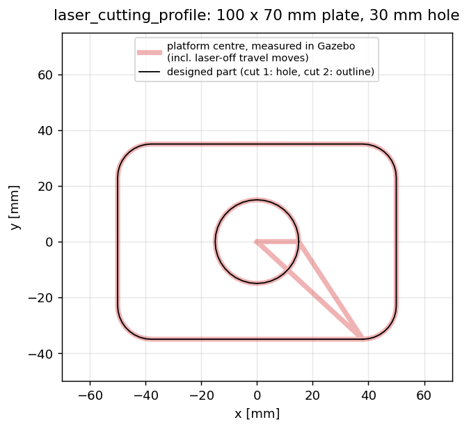
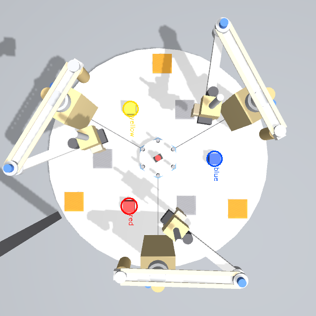
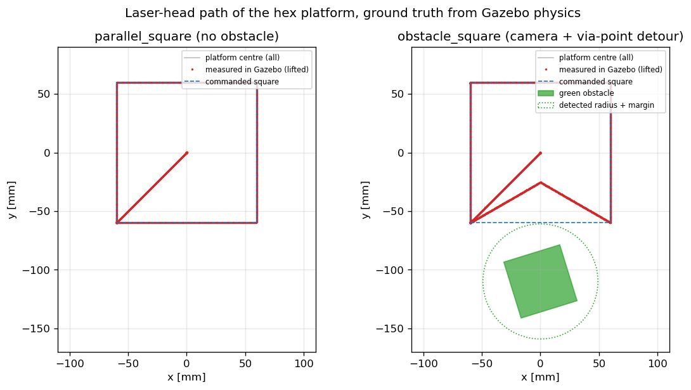
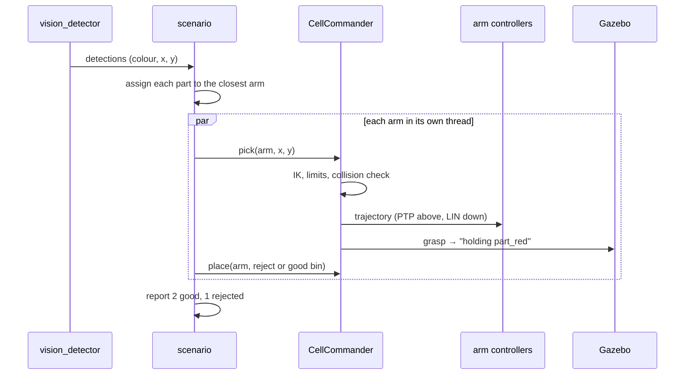

# 3. Simulation and scenarios

## 3.1 What is simulated

| Part | How |
|---|---|
| Robot dynamics | Gazebo Fortress, DART physics at 1 kHz; masses and inertias from `cell.yaml` |
| Motors | ros2_control (`gz_ros2_control`), velocity‑controlled joints with the effort and speed limits of the real motors |
| Grippers | fingers driven by a gripper controller; a **grasp plugin** fixes the part to the gripper only if it is between the fingers |
| Platform | 6 legs on passive bearings; brake = the gripper is fixed to the platform body instead of the leg |
| Camera | overhead camera (640 × 640, 5 Hz) → `vision_detector` → object positions in metres |
| Parts / bins | three coloured 40 mm cubes; grey trays = good parts, orange trays = rejects |
| Obstacle | green 50 × 50 × 8 mm block (obstacle world) |

Three ways to run the same scenarios:

| Launch | Physics | Use it for |
|---|---|---|
| `sim.launch.py` | yes (Gazebo) | realistic behaviour, camera, grasping |
| `mock.launch.py` | no (ideal joints) | fast checks in RViz, no GPU needed |
| unit tests (`colcon test`) | no (dry run) | automatic checks of every scenario: reach, limits, collisions |

## 3.2 Scenarios and the real‑world problems they represent

```bash
ros2 launch robocraft_bringup sim.launch.py                    # terminal 1 (add world:=obstacle for the obstacle)
ros2 run robocraft_control scenario <name> --ros-args -p use_sim_time:=true   # terminal 2
```

| Scenario | Mode | Industrial problem | What the robot does |
|---|---|---|---|
| `serial_pick_place` | serial | **machine tending / kitting**: three independent workstations on one table | all three arms move their part from infeed to outfeed at the same time; the interlock prevents collisions |
| `vision_sorting` | serial | **quality inspection and reject sorting** | the camera classifies and locates every part; red = defective → reject bin, others → good bin |
| `parallel_square` | parallel | **laser engraving** of a pattern | three arms carry the platform; the laser draws a square |
| `laser_cutting_profile` | parallel | **laser cutting a sheet part** (metal, acrylic, wood) | cuts a 100 × 70 mm plate with rounded corners; the bolt hole first, then the outline; laser off for travel moves |
| `obstacle_square` | parallel | **cutting around clamps / keep‑out zones** | the camera finds the green obstacle; edges that pass too close get a via‑point detour |
| `pure_rotation` | parallel | **re‑orienting a workpiece** beyond one robot's range | two arms turn 60°, the third takes over, the others regrasp; 6 cycles = 360° |
| `locked_transport` | serial | **fixture / pallet transfer** by one robot | with the brake on, one arm moves and rotates the platform alone |
| `reconfiguration_demo` | both | **flexible manufacturing** | serial work → couple → cooperative work → decouple → serial work |

Options: `ros2 run robocraft_control scenario list` and the docstring of each function in
[`scenarios/library.py`](../robocraft_ws/src/robocraft_control/robocraft_control/scenarios/library.py).
Examples: `--side 0.1`, `--cycles 2`, `--reject red,blue`, `--width 0.08 --hole_diameter 0.02`.

## 3.3 Results measured in Gazebo

Ground truth from the physics engine, headless, speed override 0.8–1.0.

| Scenario | Result |
|---|---|
| `serial_pick_place` | 3 arms working concurrently; every cube placed within **0.1 mm** of its target |
| `vision_sorting` | camera position error **≤ 3.5 mm**; 2 parts to good bins, 1 red part to the reject bin, each within ~3 mm |
| `parallel_square` | platform traced **±60.0 mm**, lifted 15 mm, orientation constant (30.0°) |
| `laser_cutting_profile` | 413 mm of cut; measured path exactly **100 × 70 mm**, hole traced on the 30 mm circle |
| `obstacle_square` | obstacle located within ~1 mm; 1 detour; laser stayed **≥ 73 mm** from the obstacle centre |
| `pure_rotation` (2 cycles) | platform turned **30° → 150°**, no sideways drift, 6 regrasps verified |
| `locked_transport` | a single arm moved the platform 40 mm and rotated it +30° and back |
| `reconfiguration_demo` | complete cycle, cubes back at their start positions |

<p align="center">
  
  
</p>
<p align="center">
  
  
</p>
<p align="center">
  
</p>

## 3.4 How a scenario works (example: vision sorting)



## 3.5 Design notes

* **The grasp is a verified weld.** Friction grasping in physics engines is unreliable, so the
  plugin creates a fixed joint, but only if the object is within 20 mm of the finger centre (like a
  part‑present sensor).
* **Redundant actuation is stable** because all arms follow trajectories from the same platform
  motion with one common start time; the measured paths above show no drift.
* **Collisions between arms** are prevented by planning, not by the physics engine: the arms belong to
  one model and do not collide with each other in Gazebo.
