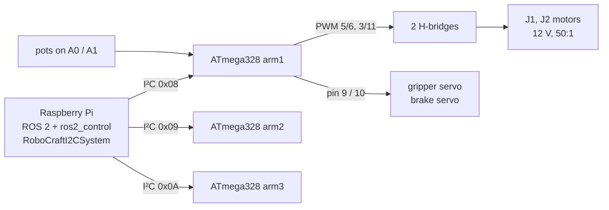
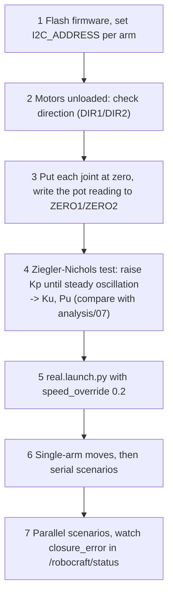

# 4. Hardware: electronics, protocol, firmware

## 4.1 Topology



The Raspberry Pi runs the whole ROS 2 stack. `robocraft_hardware` is a ros2_control
**hardware interface**, so the same controllers and scenarios used in Gazebo drive the real robot
(`real.launch.py`). J3/J4 did not exist on the 2019 prototype; the driver simulates them
(`virtual_joints`) until that hardware is added.

<p align="center"></p>

## 4.2 I²C protocol (v2)

The thesis observed corrupted values on the I²C bus (§4.3.3). Every message now has a fixed
layout, a sequence number and a CRC‑8 checksum. A damaged message is ignored.

| Direction | Bytes |
|---|---|
| Pi → ATmega (9 B) | `0xA5` · seq · q1 (int16, 0.01°) · q2 (int16, 0.01°) · gripper angle · flags (enable, brake, clear fault) · CRC‑8 |
| ATmega → Pi (8 B) | `0x5A` · seq · q1 · q2 · status (enabled, fault, watchdog, at target) · CRC‑8 |

The same format is implemented three times and tested against each other:
[Python](../robocraft_ws/src/robocraft_kinematics/robocraft_kinematics/protocol.py),
[C++](../robocraft_ws/src/robocraft_hardware/src/robocraft_i2c_system.cpp),
[firmware](../robocraft_ws/src/robocraft_hardware/firmware/robocraft_joint_firmware/robocraft_joint_firmware.ino).

## 4.3 Firmware

[`robocraft_joint_firmware.ino`](../robocraft_ws/src/robocraft_hardware/firmware/robocraft_joint_firmware/robocraft_joint_firmware.ino),
compiled for Arduino Uno / ATmega328P (25 % flash, 22 % RAM):

* 200 Hz position loop per joint: **PI + velocity feed‑forward**, anti‑windup, dead band
* potentiometer linearisation from the thesis calibration
* **safety:** watchdog (no valid message for 250 ms → motors off), soft limits, fault latch
* gains from the motor model ([analysis/07](../analysis/README.md#07-motor-model-and-controller-tuning))

**Bugs found in the 2019 appendix code and fixed:**

| 2019 | Problem | Fix |
|---|---|---|
| potentiometers on A4/A5 | A4/A5 are the I²C pins (SDA/SCL) of the ATmega328 | A0/A1 |
| `analogWrite` on pins 7 and 8 | these pins have no PWM hardware | 5/6 (Timer 0) and 3/11 (Timer 2); servos on 9/10 (Timer 1) |
| raw integer arrays | corrupted values reached the motors | CRC‑8 frames |
| no timeout | motors keep running if the Pi stops | 250 ms watchdog |

## 4.4 Commissioning procedure



```bash
ros2 launch robocraft_bringup real.launch.py i2c_device:=/dev/i2c-1 i2c_addresses:=8,9,10
ros2 run robocraft_control scenario serial_pick_place --ros-args -p grasp_mode:=simulated -p speed_override:=0.2
```

## 4.5 Recommended hardware upgrades

| Upgrade | Why | Reference |
|---|---|---|
| 16‑bit ADC (ADS1115) or 12‑bit magnetic encoder (AS5600) | position resolution 27 mm → below 1 mm at the tip | [analysis/06](../analysis/README.md#06-position-sensor) |
| Z axis + wrist (J3/J4) | completes the industrial SCARA layout used in the simulation | [design](01_design.md#16-what-was-changed-to-make-it-industrial) |
| Current sensing in the H-bridge | torque limiting and collision detection | – |

> ⚠️ The C++ driver is compiled and unit-tested but has not yet run against the physical ATmega
> boards. Commission step by step, with the motors unloaded first.
