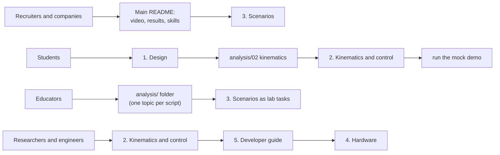

# Documentation

Short, focused pages. Each one can be read on its own in 5–10 minutes.

| Page | What you learn |
|---|---|
| [1. Design](01_design.md) | The mechanical and electrical design of the 2019 robot and what was changed to make it industrial |
| [2. Kinematics and control](02_kinematics_and_control.md) | How the arms and the platform are moved: equations, trajectories, safety, software architecture |
| [3. Simulation and scenarios](03_simulation_and_scenarios.md) | The Gazebo simulation and the eight industrial scenarios, with measured results |
| [4. Hardware](04_hardware.md) | Electronics, I²C protocol, firmware and how to commission the real robot |
| [5. Developer guide](05_developer_guide.md) | Code map, conventions, how to add a scenario, tests and CI |
| [Engineering analysis](../analysis/README.md) | Eight calculation scripts: workspace, kinematics, dynamics, deflection, trajectories, sensor, control, parallel workspace |

## Where to start

**Suggested learning path for students** (each step builds on the previous one):

1. Read [1. Design](01_design.md) to see what the robot is.
2. Run `python3 analysis/02_kinematics.py` and read its header: forward/inverse kinematics.
3. Run `python3 analysis/05_trajectory_planning.py`: how motions are planned.
4. Start the mock demo (`ros2 launch robocraft_bringup mock.launch.py scenario:=serial_pick_place`) and read
   [`scenarios/library.py`](../robocraft_ws/src/robocraft_control/robocraft_control/scenarios/library.py).
5. Write your own scenario with the [developer guide](05_developer_guide.md).
6. Run it in Gazebo with physics and the camera.

## Units and conventions (used everywhere)

* SI units in code and configuration: metres, radians, seconds, kilograms. Documents may show mm and degrees.
* World frame: origin at the centre of the base plate, z up.
* Arm joint zero points at the cell centre. `J1`, `J2` rotate about z, `J3` moves the quill down (positive = down), `J4` rotates the tool.
* One source of truth for all dimensions: [`cell.yaml`](../robocraft_ws/src/robocraft_description/config/cell.yaml).
